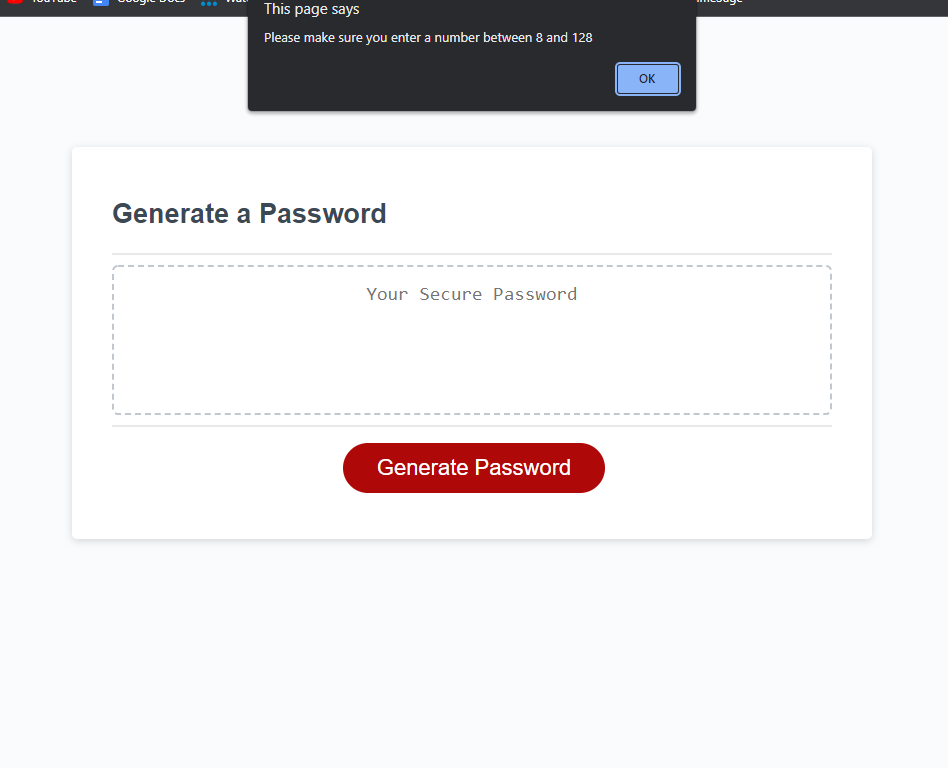
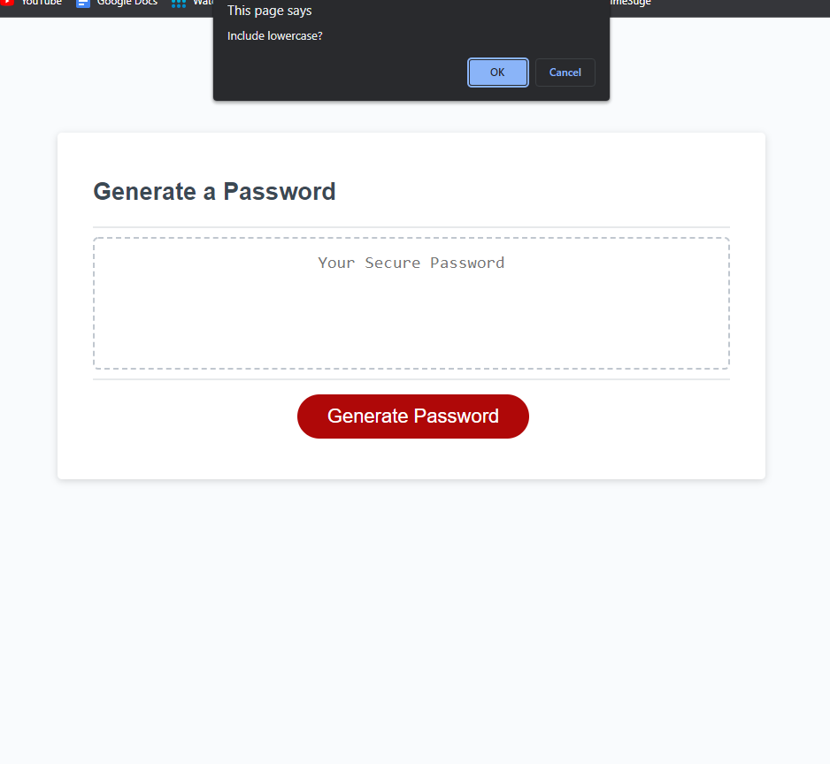
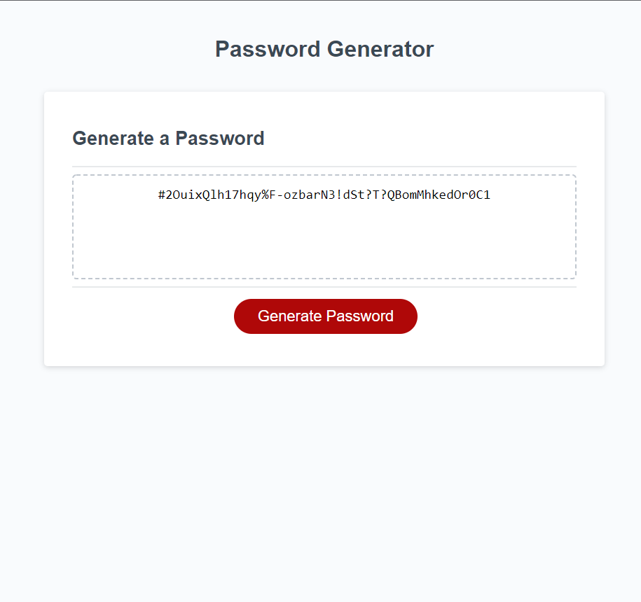

Javascript Password Generator

DESCRIPTION:
This password generator uses Javascript to generate a random password according to user input. When the "Generaste Password" button is clicked the user will be guided to enter criteria by a series of prompts.  

This random password generator was the week 3 homework challenge for the Monash University coding bootcamp. Starter code was provided, the only part of the code that needed work was the script.js file and README.md.

Aside from the practice in coding Javascript, this homework challenge taught me the importance of using pseudo code. Both for communicating what I am doing to whoever is reading my code, and for organising my own thoughts at the beginning of a project.  

The Javascript Password Generator has been deployed using GitHub pages. You can find it at the following link: 

USAGE:
The user must enter a password length between 8 and 128 characters, and can choose to include upper and lowercase letters, numbers and special characters. The generated password will then appear in the output box. If the user enters a value outside of the 8 to 128 characters parameter, or if anything but a number is entered, and reminder prompt will appear to reitterate the requirements.

